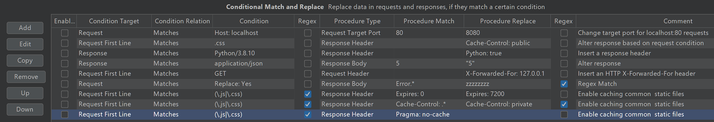
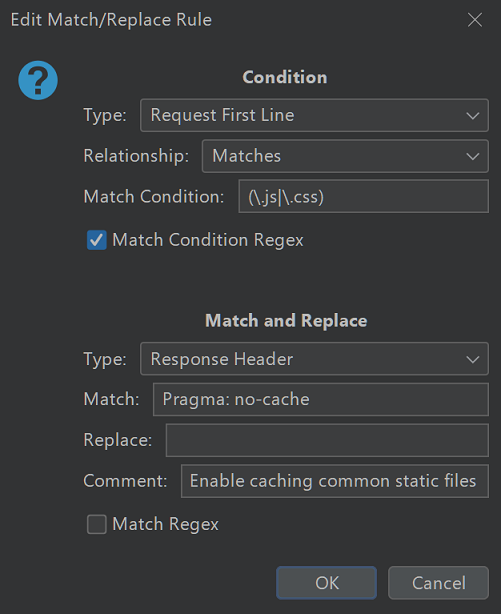

Conditional Match and Replace (CMAR)

An extension allowing you to create match and replace operations that execute only when a condition is matched (or not matched). The condition can be matched against the request Header/Body/All, or the response Header/Body/All. If the condition is matched, you can apply a match and replace rule against the specified area. You can create a condition that matches a request, then performs a match and replace in the response.

CMARs work in a chain, updating the request/response then moving to the next rule. *If you have a CMAR that changes a request, and the subsequent rule matches a condition that was only present before the match and replace, it will not fire.*

Conditions support regex and literal matching, as does the match and replace function.

### Extension uses:
* Changing caching on some files
* Adding request headers (such as Authorization) to only some requests
* Alter a common string in the response for only some pages/targets.
* Change the target host or port a request is sent to

### Screenshots:

### Building

`gradle build` outputs the jar into build/libs/cmar.jar.

### Dependencies

CMAR only has one dependency, for the Burp Extender API (version 2.3), which all Burp Apps require. This is available [in a Maven repository](https://mvnrepository.com/artifact/net.portswigger.burp.extender/burp-extender-api/2.3) and should be fetched automatically if you use gradle to build. The hash for this jar is verified in newer versions of gradle.

### TODO/bugs

### Missing Features:
* allow multiple conditions for a match
* regex for target port during replace

### Tests

Tests can be run by setting `runTests = true` in the BurpExtender.java file. Leave this disabled normally.